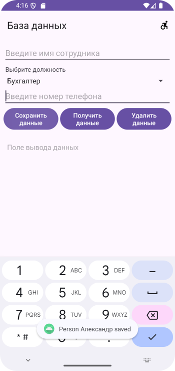
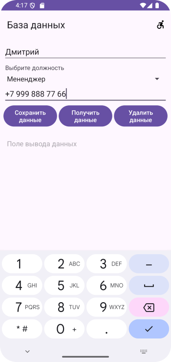
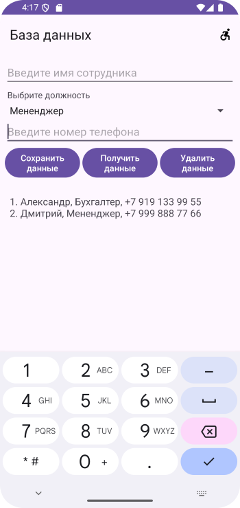
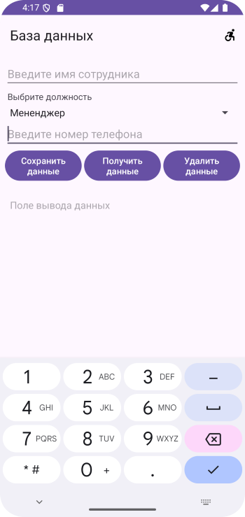
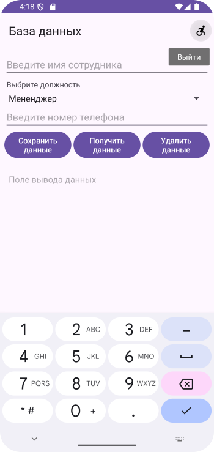

# Домашнее задание по теме "SQL"

## Приложение «База данных»

Необходимо написать приложение по созданию базы данных аналогично материалу основного занятия. Количество сохраняемых полей в базу данных выбирается произвольно, но не менее трех, допустим, имя, должность, телефон. Приложение запускается со стартового экрана с названием **«База данных»**. По нажатию кнопки **«Начать работу»** выполняется переход на следующий экран для ввода данных, их сохранения, чтения и удаления. При выборе пункта меню **«Exit»** на втором экране приложение закрывается.

Для работы приложения необходимо создать:

На первом экране:

1. Поле вывода с название приложения **«База данных»**.

2. Кнопку **«Начать»**.

На втором экране:

1. Toolbar с заголовком **«База данных»**.

2. Поля ввода: имени, должности и телефона (для выбора должности использовать **Spinner**, в зависимости от специфики, выбранной Вами профессии, здесь представлено на личное усмотрение).

3. Кнопки **«Сохранить данные», «Получить данные», «Удалить данные».**

4. Поля вывода информации при чтении их из базы данных.

5. Меню с одним пунктом **«Exit»**.

Приложение необходимо сохранить проектом в удаленном репозитории, для проверки качества предоставить ссылку преподавателю, либо сделать скрины эмулятора при каждом шаге работы приложения или видео работы реального устройства.

## Скриншоты домашнего задания по теме "SQL"

Скриншоты находятся здесь

